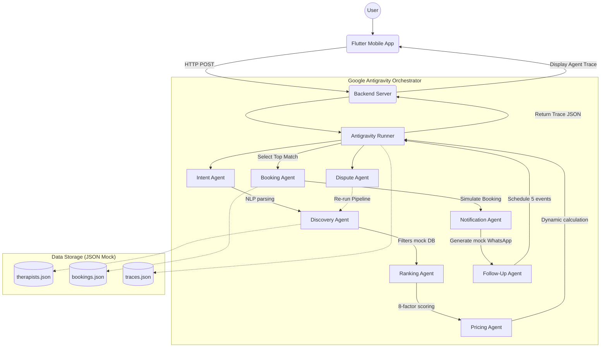

# NoorAI Architecture

NoorAI relies on a centralized multi-agent orchestration architecture using Google Antigravity as the core engine.

## System Components
1. **Flutter Mobile App**: Contains the frontend screens including Home, Results, Agent Trace, Dispute, and Baseline Comparison.
2. **FastAPI Backend**: Acts as a bridge between the mobile app and the Antigravity Orchestrator. 
3. **Google Antigravity Runner**: The core orchestration mechanism ensuring that the Workplan and Tasks Plan are properly executed and handed off between agents.
4. **Mock DBs**: Instead of a full relational DB, we're using mock JSON datasets to enable quick testing, local-only runs, and predictable demos.
